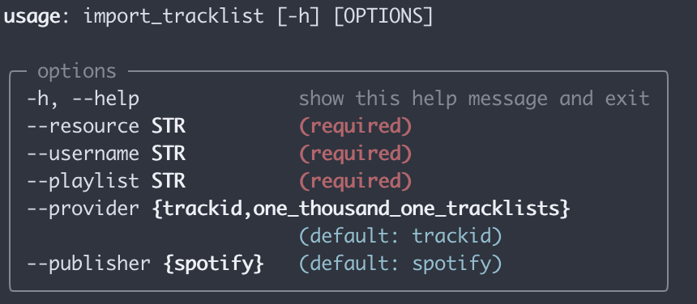

# Tracklist to Spotify
Ever listened to a set, found the tracklist and wanted to save it in a Spotify playlist? This tool does just that.

Supported tracklist providers:
1. trackid.net
2. 1001tracklists.com

Supported music services:
1. Spotify

## Usage



### Installation
#### via pipx
You must have [pipx installed](https://github.com/pypa/pipx?tab=readme-ov-file#install-pipx).
```bash
pipx install git+https://github.com/lucapericlp/tracklist-to-spotify.git
# this should print the help message
import_tracklist --help
```

#### via clone
You must have [uv installed](https://docs.astral.sh/uv/getting-started/installation/)
```bash
git clone https://github.com/lucapericlp/tracklist-to-spotify.git && cd tracklist-to-spotify
uv sync
# this should print the help message
uv run import_tracklist --help
```

### Running
#### Publishing a tracklist to Spotify
##### Setup Spotify API
1. Create [a Spotify Developer account](https://developer.spotify.com/)
2. Create a new app
3. Ensure the redirect URI in Spotify app dashboard is set to `http://localhost:8080`
4. Use the client ID and client secret to set the environment variables
```bash
export SPOTIPY_CLIENT_ID=your_client_id
export SPOTIPY_CLIENT_SECRET=your_client_secret
export SPOTIPY_REDIRECT_URI=http://localhost:8080/
```

##### trackid.net to Spotify
```bash
import_tracklist \
    --provider trackid \
    --resource "https://trackid.net/audiostreams/estella-boersma-stone-techno-2024-arte-concert" \
    # OR
    # --resource estella-boersma-stone-techno-2024-arte-concert \
    --username <spotify_username> \
    --playlist "Estella Boersma - Stone Techno 2024 - ARTE Concert"
```

##### 1001tracklist to Spotify
```bash
import_tracklist \
    --provider one_thousand_one_tracklists \
    --resource "https://www.1001tracklists.com/tracklist/2l7dw0z1/chris-stussy-dj-mag-straat-museum-amsterdam-netherlands-2021-03-10.html" \
    --username <spotify_username> \
    --playlist "Stussy @ DJ Mag Straat Museum Amsterdam Netherlands 2021-03-10"
```
